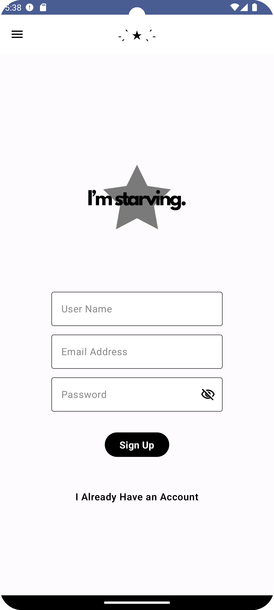

# Food Recipe Application

Welcome to the Food Recipe Application repository! This application is designed to help users discover and manage their favorite recipes. Whether you're a seasoned chef or a beginner in the kitchen, this app is your companion for culinary exploration.

## Features

- **Browse Recipes:** Explore a wide variety of recipes from different cuisines.
- **Search Functionality:** Find recipes by ingredients, cuisine, or dish name.
- **Save Favorites:** Mark recipes as favorites for quick access.
- **Recipe Details:** View detailed information about each recipe, including ingredients, instructions, and nutritional information.
- **User-Friendly Interface:** Easy-to-navigate UI for a seamless user experience.
- **AI Chat:** Get personalized cooking tips and recipe recommendations through our integrated AI chat feature.


## Screenshots

<p float="left">
  
  
</p>
<p float="left">
  
  
</p>
<p float="left">
  
  
</p>
<p float="left">
  
  
</p>
<p float="left">
  
  
</p>
<p float="left">
  
</p>

## Installation

To get started with the Food Recipe Application, follow these steps:

1. **Clone the Repository:**
    ```bash
    git clone https://github.com/sumeyrapolat/FoodRecipeApplication.git
    ```
2. **Navigate to the Project Directory:**
    ```bash
    cd FoodRecipeApplication
    ```
3. **Install Dependencies:**
    ```bash
    npm install
    ```
4. **Start the Application:**
    ```bash
    npm start
    ```

## Usage

Once the application is running, you can:

- Browse through the list of available recipes.
- Use the search bar to find recipes that match your criteria.
- Click on a recipe to view detailed information.
- Save your favorite recipes for easy access later.

## Contributing

We welcome contributions from the community! To contribute to the Food Recipe Application:

1. Fork the repository.
2. Create a new branch for your feature or bugfix.
    ```bash
    git checkout -b feature/your-feature-name
    ```
3. Make your changes and commit them.
    ```bash
    git commit -m "Add new feature"
    ```
4. Push your changes to your forked repository.
    ```bash
    git push origin feature/your-feature-name
    ```
5. Create a pull request on the original repository.

## License

This project is licensed under the MIT License. See the [LICENSE](LICENSE) file for more information.

## Contact

If you have any questions or feedback, please feel free to reach out to us at sumeyrapolat@example.com.

---

Thank you for using the Food Recipe Application! We hope it makes your culinary adventures more enjoyable.
